# AI 法律助手 - 产品需求文档 (PRD)

> 版本：v1.0  
> 日期：2026-02-08  
> 状态：初稿

---

## 目录

1. [产品概述](#1-产品概述)
2. [用户角色与使用场景](#2-用户角色与使用场景)
3. [功能模块详细定义](#3-功能模块详细定义)
4. [系统架构设计](#4-系统架构设计)
5. [前端产品设计](#5-前端产品设计)
6. [后端 API 设计](#6-后端-api-设计)
7. [核心流程设计](#7-核心流程设计)
8. [数据模型设计](#8-数据模型设计)
9. [非功能性需求](#9-非功能性需求)
10. [技术选型](#10-技术选型)
11. [项目结构](#11-项目结构)
12. [实现优先级与里程碑](#12-实现优先级与里程碑)

---

## 1. 产品概述

### 1.1 产品定位

AI 法律助手是一款面向律师、法务人员和普通用户的智能法律服务平台。基于通义千问大语言模型和 Go Eino 框架构建，提供从法律咨询、文书撰写到证据管理的全流程 AI 辅助能力。

### 1.2 核心价值

- **降低门槛**：让不具备法律专业知识的普通用户也能获得专业级法律指导
- **提升效率**：将律师的重复性文书工作（诉状撰写、合同审查）从小时级缩短到分钟级
- **质量保障**：基于法律知识体系的 Prompt 工程，确保输出内容的专业性和规范性
- **全流程覆盖**：取证 → 咨询 → 文书 → 证据整理 → 沟通，覆盖法律服务关键环节

### 1.3 产品边界

- **做**：AI 辅助法律咨询、文书生成、合同审查、证据整理、沟通策略
- **不做**：不替代律师出庭、不提供最终法律意见书的签署、不做案件代理

---

## 2. 用户角色与使用场景

### 2.1 用户角色定义

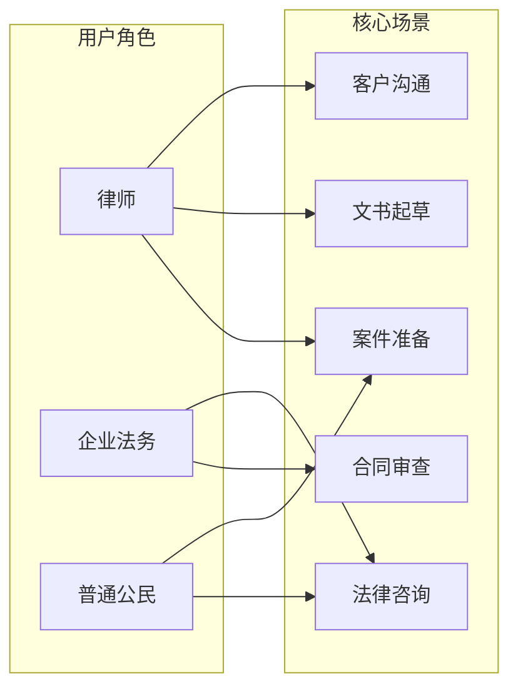

### 2.2 角色详细说明

**律师**
- 使用频率：高频（每日使用）
- 核心需求：快速生成诉状初稿、整理证据清单、生成当事人沟通话术
- 痛点：重复性文书工作耗时长，需要快速响应客户咨询

**企业法务**
- 使用频率：中频（每周数次）
- 核心需求：合同风险审查、合同条款优化建议、法律合规咨询
- 痛点：合同量大，人工逐条审查效率低

**普通公民**
- 使用频率：低频（按需使用）
- 核心需求：法律问题咨询、了解维权流程、获取取证指导
- 痛点：法律知识匮乏，不知道如何维护自身权益

### 2.3 典型使用场景

| 场景 | 用户 | 流程描述 |
|------|------|----------|
| 租房纠纷咨询 | 普通公民 | 描述问题 → AI 分析法律关系 → 给出维权建议和法律依据 |
| 劳动仲裁起诉 | 律师 | 输入案情 → 选择文书类型 → AI 生成仲裁申请书 → 律师修改确认 |
| 采购合同审查 | 企业法务 | 上传合同 PDF → AI 识别风险条款 → 输出修改建议报告 |
| 交通事故取证 | 普通公民 | 描述事故情况 → AI 指导取证方向 → 列出证据清单和注意事项 |
| 客户首次沟通 | 律师 | 输入案件背景 → AI 生成沟通话术 → 提供关键问题清单 |

---

## 3. 功能模块详细定义

### 3.1 功能模块总览

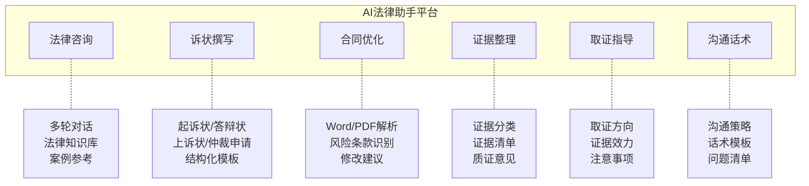

### 3.2 模块一：法律咨询

**功能描述**：多轮对话式法律问答，覆盖民事、刑事、行政、劳动法、知识产权等领域。

**功能要求**：
- 支持多轮对话，AI 能记忆上下文
- 根据问题领域自动匹配相关法律条文
- 回答中引用具体法律法规和条款编号
- 给出可操作的建议和下一步行动指引
- 对于超出 AI 能力范围的问题，建议用户咨询专业律师

**输入**：用户自然语言描述的法律问题

**输出**：结构化法律建议，包含法律分析、适用法律、建议措施、风险提示

**对话流程**：

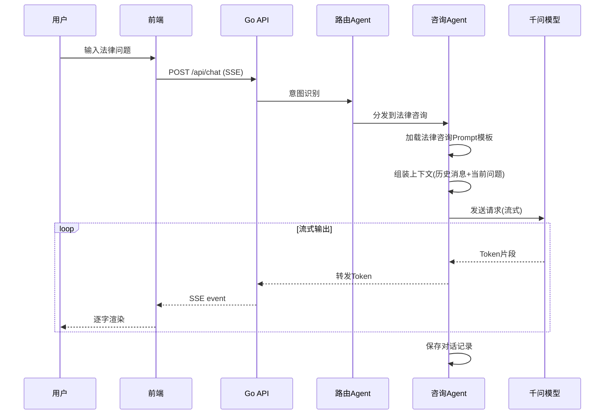

### 3.3 模块二：诉状撰写

**功能描述**：根据用户提供的案情信息，自动生成规范的法律文书。

**支持文书类型**：
- 民事起诉状
- 民事答辩状
- 上诉状
- 劳动仲裁申请书
- 行政复议申请书
- 执行申请书

**功能要求**：
- 通过对话式交互逐步收集案情要素（原告/被告信息、事实经过、诉讼请求）
- 按照法院规范格式生成文书
- 支持在线编辑和修改
- 支持导出为 Word 文档

**文书生成流程**：

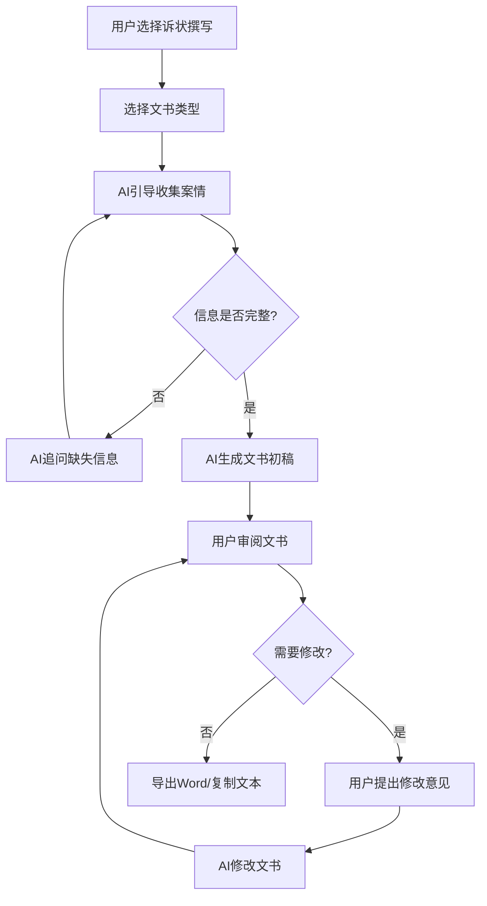

### 3.4 模块三：合同优化

**功能描述**：上传 Word/PDF 合同文件，AI 自动审查并提出优化建议。

**功能要求**：
- 支持上传 .docx 和 .pdf 格式文件（最大 20MB）
- 自动解析合同文本内容
- 识别潜在风险条款（违约金过高、免责条款不合理、期限约定模糊等）
- 逐条给出修改建议和修改后的条款文本
- 评估合同整体风险等级（低/中/高）
- 支持导出审查报告

**合同审查流程**：

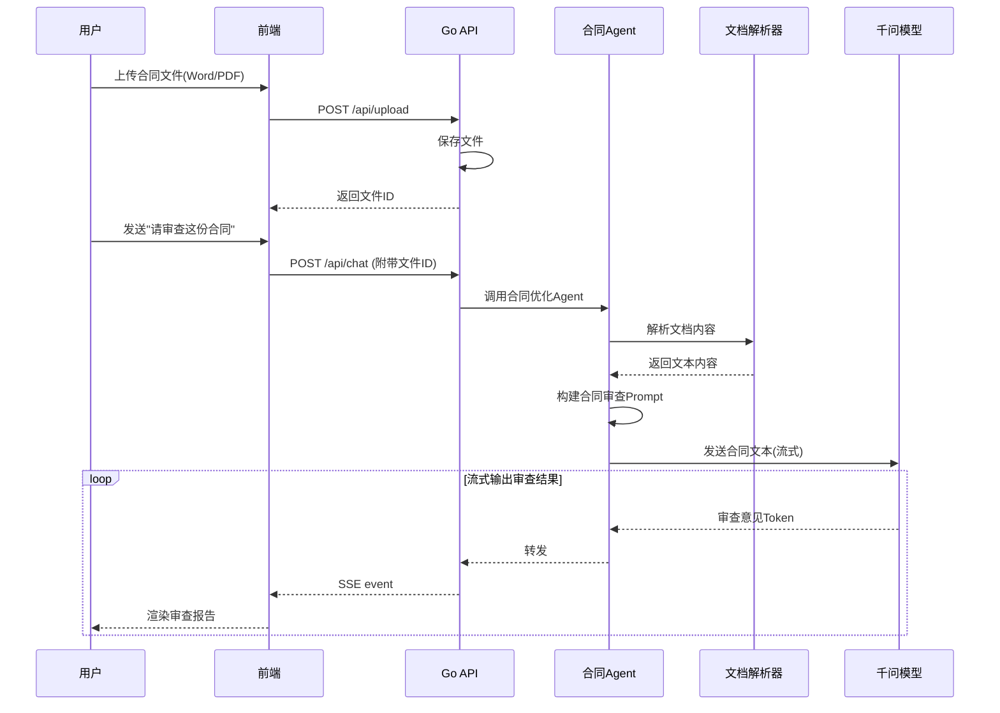

### 3.5 模块四：证据整理

**功能描述**：帮助用户对已收集的证据材料进行分类、排序，并生成规范的证据清单。

**功能要求**：
- 用户可以文字描述证据材料，也可以上传证据文件
- AI 自动对证据进行分类（书证、物证、证人证言、电子数据等）
- 按照证明目的对证据进行排序
- 生成法院规范格式的证据清单（含编号、名称、来源、证明目的）
- 生成针对每份证据的质证意见要点

**输入**：证据描述文本 / 证据文件

**输出**：结构化证据清单（表格格式）+ 质证意见

### 3.6 模块五：取证指导

**功能描述**：根据案件类型和具体情况，指导用户收集哪些证据，以及取证注意事项。

**功能要求**：
- 根据案件类型（劳动争议、交通事故、合同纠纷等）给出取证方向
- 列出每类证据的具体形式和获取途径
- 提示证据保全的方法和时效
- 分析各类证据的法律效力
- 提醒取证过程中的法律风险（如非法取证导致证据无效）

**取证指导流程**：

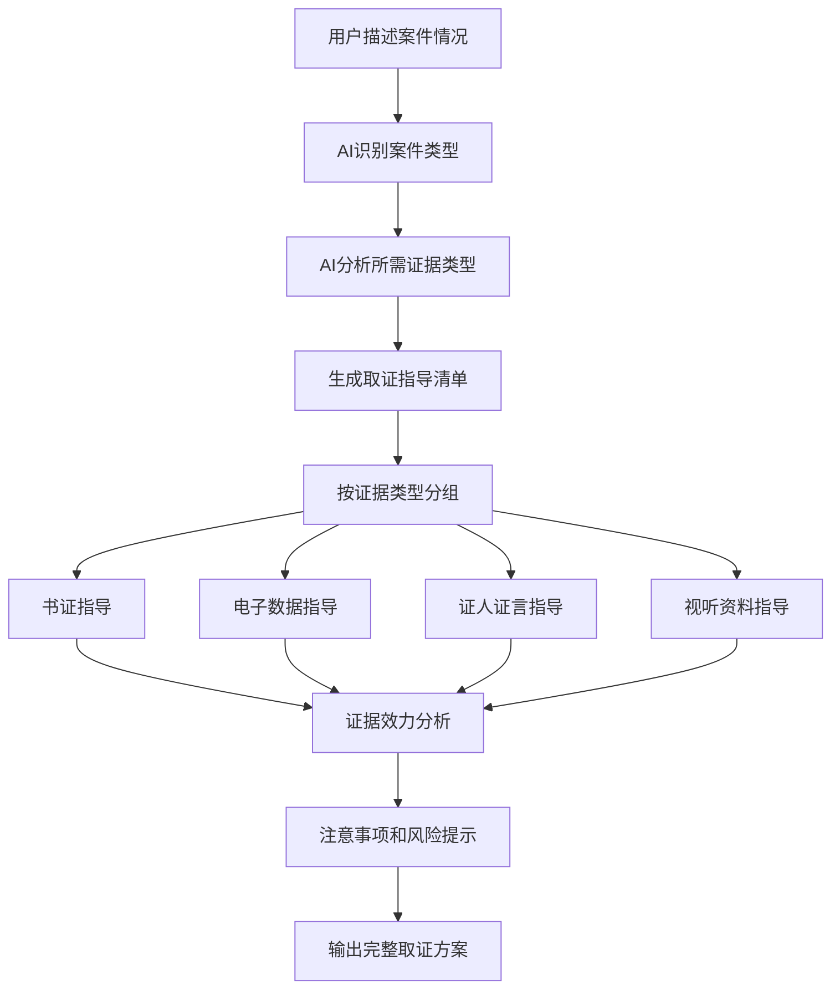

### 3.7 模块六：沟通话术

**功能描述**：为律师生成与客户/当事人的沟通话术模板和策略建议。

**功能要求**：
- 根据案件背景和沟通目的生成话术模板
- 支持多种沟通场景：初次接待、案情沟通、风险告知、费用协商、结果通知
- 提供关键问题清单（律师需向当事人确认的关键信息）
- 话术语气可调：专业正式 / 温和亲切 / 简洁直接
- 提醒沟通中的法律风险（如承诺不当）

---

## 4. 系统架构设计

### 4.1 整体架构图

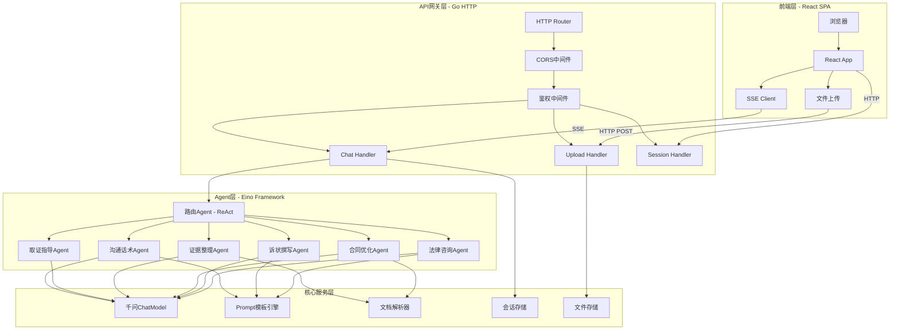

### 4.2 Agent 调度架构

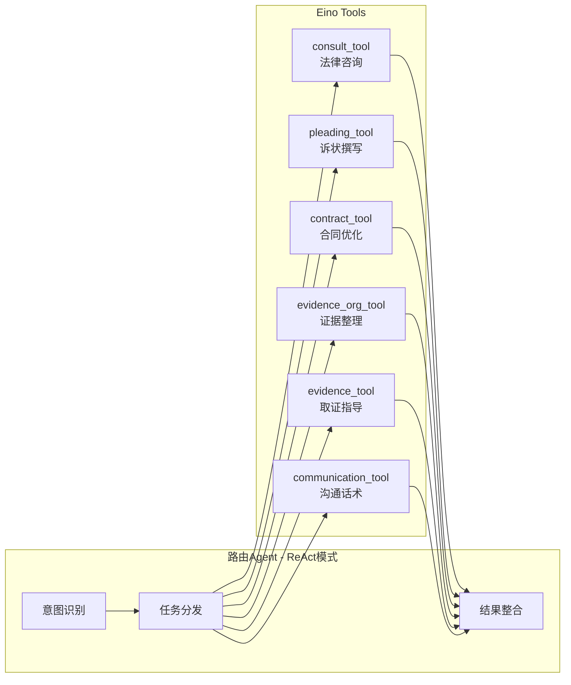

### 4.3 Eino 编排图（Graph）

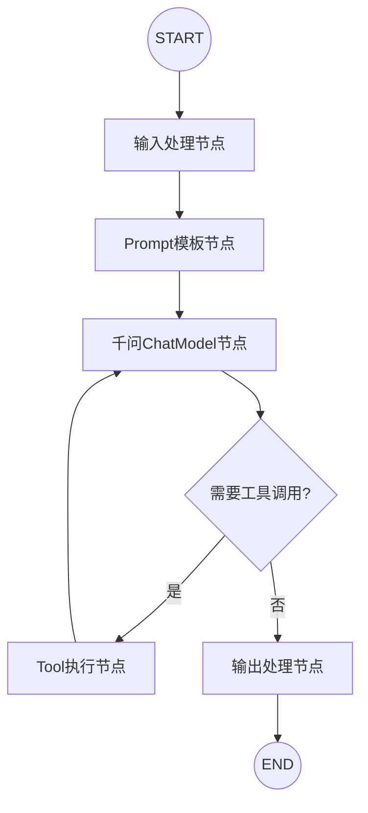

每个功能 Agent 内部的 Eino Graph 编排遵循以上模式。路由 Agent 使用 ReAct 循环，内部 Agent 使用 Chain 或 Graph 线性编排。

---

## 5. 前端产品设计

### 5.1 页面布局

```
+------------------+---------------------------------------------+
|                  |  [模块名称]                     [新建会话] ⊕  |
|  LOGO            +---------------------------------------------+
|  AI法律助手       |                                             |
|                  |  ┌─────────────────────────────────────────┐ |
|  ═══════════     |  │ 🤖 您好！我是AI法律助手。               │ |
|                  |  │    请问有什么法律问题需要帮助？           │ |
|  ▷ 法律咨询      |  └─────────────────────────────────────────┘ |
|    诉状撰写      |                                             |
|    合同优化      |  ┌─────────────────────────────────────────┐ |
|    证据整理      |  │ 👤 我和房东有租房合同纠纷，房东无故       │ |
|    取证指导      |  │    要求我提前搬离，但合同还有半年到期...   │ |
|    沟通话术      |  └─────────────────────────────────────────┘ |
|                  |                                             |
|  ═══════════     |  ┌─────────────────────────────────────────┐ |
|  历史会话        |  │ 🤖 根据您描述的情况，这是一起典型的       │ |
|  ┊ 租房纠纷咨询  |  │    房屋租赁合同纠纷。以下是我的分析：     │ |
|  ┊ 劳动合同审查  |  │                                         │ |
|  ┊ 交通事故取证  |  │    **一、法律关系分析**                   │ |
|                  |  │    根据《民法典》第733条...               │ |
|                  |  │    ▌ (流式输出中)                        │ |
|                  |  └─────────────────────────────────────────┘ |
|                  +---------------------------------------------+
|                  | ┌─────────────────────────┐  📎  ▶ 发送    |
|                  | │ 输入您的法律问题...       │                 |
|                  | └─────────────────────────┘                 |
+------------------+---------------------------------------------+
```

### 5.2 页面组件树

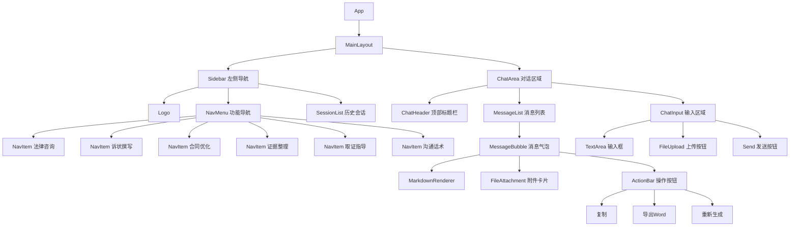

### 5.3 前端状态管理

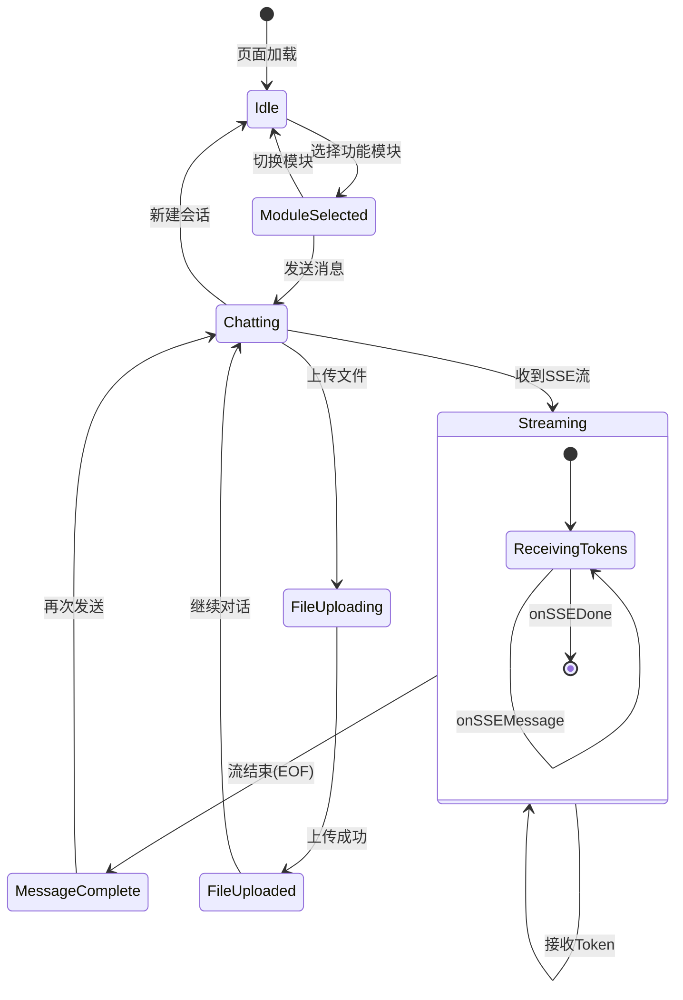

### 5.4 各功能模块页面特殊 UI

| 功能模块 | 特殊UI元素 |
|---------|-----------|
| 法律咨询 | 标准对话界面，回复中高亮法律条文引用 |
| 诉状撰写 | 文书类型选择卡片，生成结果显示文书预览框+导出按钮 |
| 合同优化 | 文件上传拖拽区，审查结果显示风险等级徽标+逐条建议 |
| 证据整理 | 证据清单表格组件，支持拖拽排序 |
| 取证指导 | 取证清单 Checklist 组件，可勾选已完成项 |
| 沟通话术 | 话术卡片列表，支持一键复制单条话术 |

---

## 6. 后端 API 设计

### 6.1 API 总览

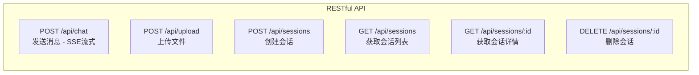

### 6.2 API 详细定义

#### POST /api/chat

发送对话消息，返回 SSE 流式响应。

**请求体**：
```json
{
  "session_id": "uuid-string",
  "module": "consult|pleading|contract|evidence_org|evidence|communication",
  "message": "用户输入的文本内容",
  "file_ids": ["file-uuid-1"],
  "metadata": {
    "document_type": "civil_complaint",
    "tone": "professional"
  }
}
```

**SSE 响应格式**：
```
event: message
data: {"type": "token", "content": "根据"}

event: message
data: {"type": "token", "content": "您描述的"}

event: message
data: {"type": "done", "message_id": "msg-uuid"}

event: error
data: {"type": "error", "message": "服务暂时不可用"}
```

#### POST /api/upload

上传文件（Word/PDF）。

**请求**：`multipart/form-data`
- `file`: 文件（最大 20MB，支持 .docx .pdf）
- `session_id`: 关联会话 ID

**响应**：
```json
{
  "file_id": "file-uuid",
  "filename": "租房合同.pdf",
  "size": 102400,
  "content_type": "application/pdf"
}
```

#### POST /api/sessions

创建新会话。

**请求体**：
```json
{
  "module": "consult",
  "title": ""
}
```

**响应**：
```json
{
  "id": "session-uuid",
  "module": "consult",
  "title": "新建法律咨询",
  "created_at": "2026-02-08T10:00:00Z"
}
```

#### GET /api/sessions

获取会话列表。

**响应**：
```json
{
  "sessions": [
    {
      "id": "session-uuid",
      "module": "consult",
      "title": "租房纠纷咨询",
      "created_at": "2026-02-08T10:00:00Z",
      "updated_at": "2026-02-08T10:30:00Z",
      "message_count": 6
    }
  ]
}
```

#### GET /api/sessions/:id

获取会话详情和历史消息。

**响应**：
```json
{
  "id": "session-uuid",
  "module": "consult",
  "title": "租房纠纷咨询",
  "messages": [
    {
      "id": "msg-uuid-1",
      "role": "user",
      "content": "我和房东有租房纠纷...",
      "file_ids": [],
      "created_at": "2026-02-08T10:00:00Z"
    },
    {
      "id": "msg-uuid-2",
      "role": "assistant",
      "content": "根据您描述的情况...",
      "file_ids": [],
      "created_at": "2026-02-08T10:00:05Z"
    }
  ]
}
```

#### DELETE /api/sessions/:id

删除指定会话。

**响应**：`204 No Content`

### 6.3 请求-响应流式时序

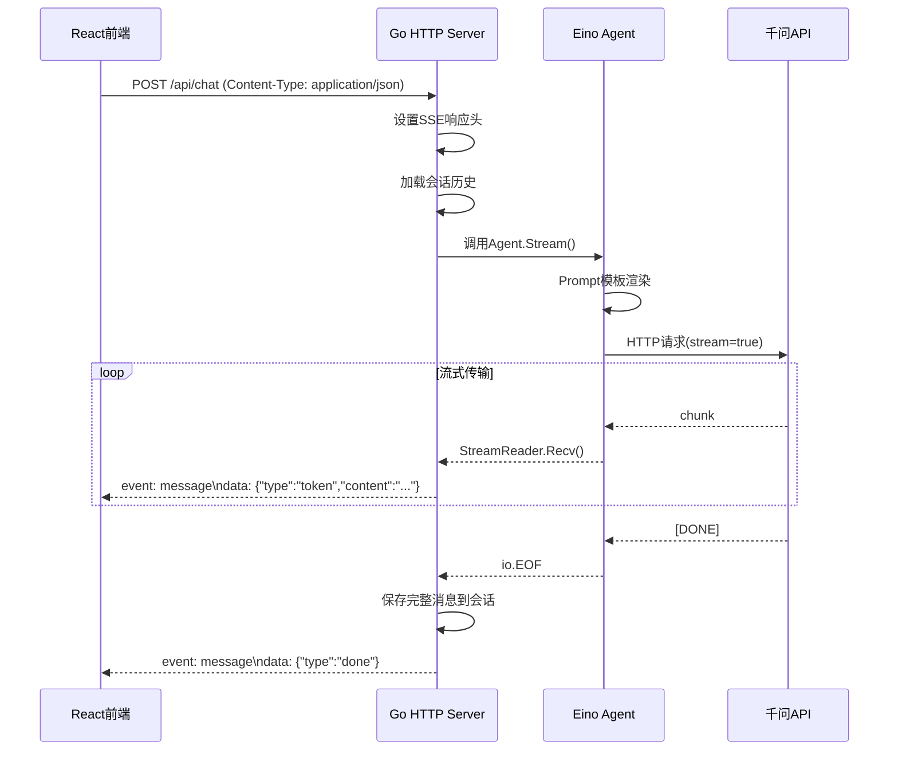

---

## 7. 核心流程设计

### 7.1 主流程 - 用户请求处理

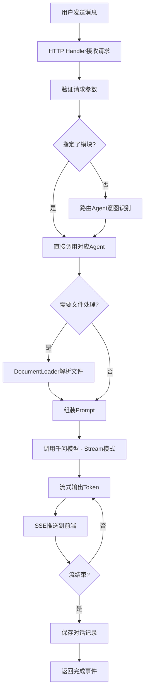

### 7.2 路由 Agent 意图识别流程

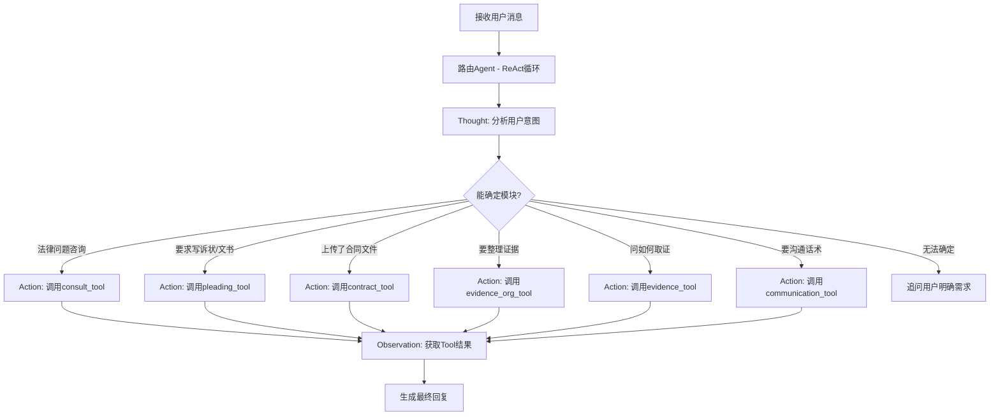

### 7.3 文档处理流程

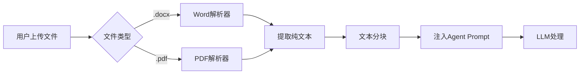

### 7.4 会话生命周期

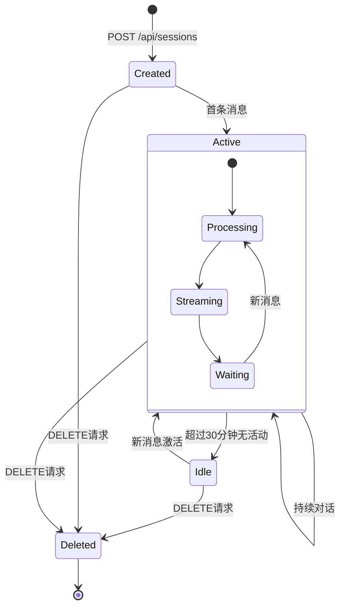

---

## 8. 数据模型设计

### 8.1 类图

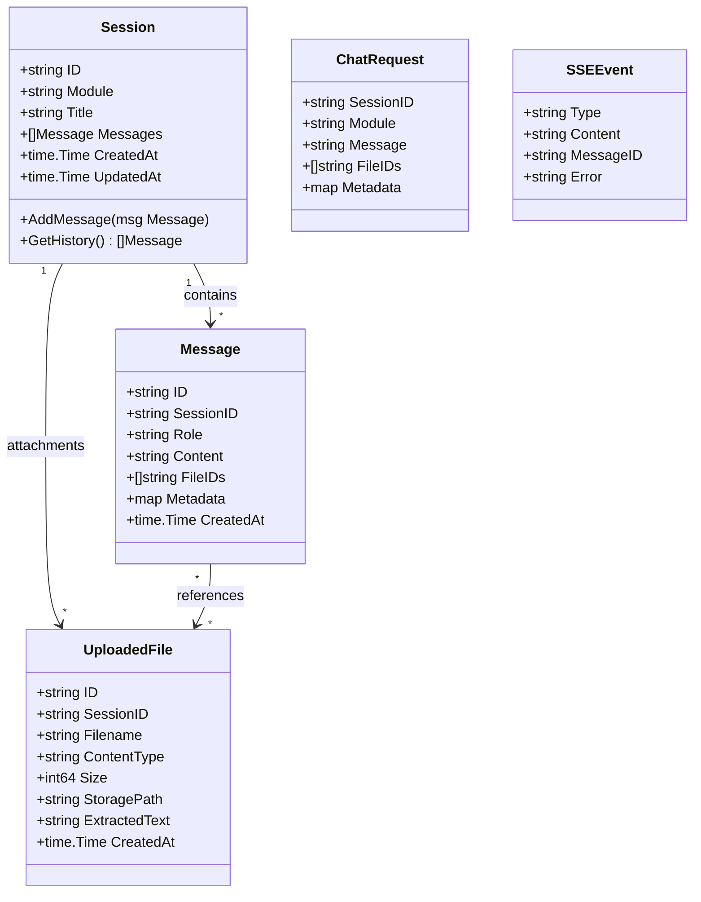

### 8.2 Agent 类图

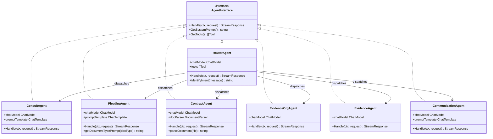

### 8.3 Eino 组件依赖关系

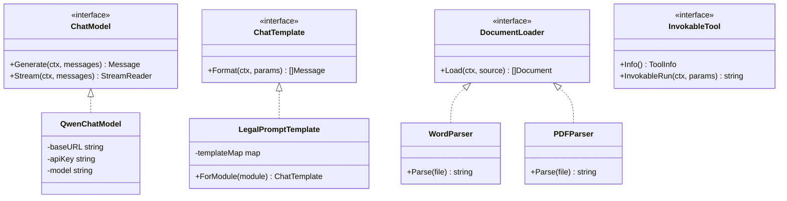

---

## 9. 非功能性需求

### 9.1 安全性

- API Key 通过环境变量管理，不硬编码在代码中
- 用户上传文件限制大小（最大 20MB）和类型（仅 .docx .pdf）
- 文件存储路径防止路径遍历攻击
- 对话内容不持久化敏感信息到日志
- CORS 配置仅允许指定前端域名
- 未来版本增加用户认证（JWT）

### 9.2 性能

- SSE 流式响应，首 Token 延迟控制在 2 秒内
- 文件上传解析在 10 秒内完成
- 前端消息列表支持虚拟滚动（超过 100 条消息时）
- API 并发处理能力：至少支持 50 个并发会话

### 9.3 可用性

- 千问 API 调用失败时优雅降级，提示用户稍后重试
- 文件解析失败时返回明确的错误信息
- 流式传输中断时，前端自动重连或提示用户

### 9.4 可维护性

- 各 Agent 模块解耦，可独立开发和测试
- Prompt 模板外置管理，可热更新
- 统一的日志和错误处理框架
- 结构化的项目目录，遵循 Go 标准布局

---

## 10. 技术选型

### 10.1 技术栈总览

```mermaid
graph TB
    subgraph frontend_stack [前端技术栈]
        React18[React 18]
        TypeScript[TypeScript]
        Vite[Vite 构建]
        TailwindCSS[Tailwind CSS]
        ShadcnUI[shadcn/ui]
        ReactMarkdown[react-markdown]
    end

    subgraph backend_stack [后端技术栈]
        Go[Go 1.21+]
        Eino[Eino Framework]
        EinoExt[eino-ext OpenAI]
        NetHTTP[net/http]
    end

    subgraph llm_stack [大模型]
        Qwen[通义千问 qwen-max]
        DashScope[DashScope API]
    end

    subgraph infra [基础设施]
        FileSystem[本地文件系统]
        MemoryStore[内存会话存储]
    end

    React18 --> TypeScript
    TypeScript --> Vite
    TailwindCSS --> ShadcnUI

    Go --> Eino
    Eino --> EinoExt
    Go --> NetHTTP

    EinoExt -->|OpenAI兼容| DashScope
    DashScope --> Qwen
```

### 10.2 关键依赖版本

**后端 (Go)**：
- `go` >= 1.21
- `github.com/cloudwego/eino` - Eino 核心框架
- `github.com/cloudwego/eino-ext/components/model/openai` - OpenAI 兼容 ChatModel
- `github.com/google/uuid` - UUID 生成
- `github.com/rs/cors` - CORS 处理

**前端 (Node.js)**：
- `react` >= 18.0
- `typescript` >= 5.0
- `vite` >= 5.0
- `tailwindcss` >= 3.4
- `react-markdown` - Markdown 渲染
- `lucide-react` - 图标库

### 10.3 千问模型接入

通过 Eino 的 OpenAI 兼容 ChatModel 接入通义千问：

```go
import "github.com/cloudwego/eino-ext/components/model/openai"

chatModel, err := openai.NewChatModel(ctx, &openai.ChatModelConfig{
    BaseURL: "https://dashscope.aliyuncs.com/compatible-mode/v1",
    APIKey:  os.Getenv("QWEN_API_KEY"),
    Model:   "qwen-max",  // 或 qwen-plus
})
```

---

## 11. 项目结构

```
law-assistant/
├── docs/
│   └── PRD.md                        # 本文档
├── cmd/
│   └── server/
│       └── main.go                   # 程序入口
├── internal/
│   ├── config/
│   │   └── config.go                 # 配置管理
│   ├── model/
│   │   └── qwen.go                   # 千问 ChatModel 初始化
│   ├── agent/
│   │   ├── agent.go                  # Agent 接口定义
│   │   ├── router.go                 # 路由 Agent
│   │   ├── consult.go                # 法律咨询 Agent
│   │   ├── pleading.go               # 诉状撰写 Agent
│   │   ├── contract.go               # 合同优化 Agent
│   │   ├── evidence_org.go           # 证据整理 Agent
│   │   ├── evidence.go               # 取证指导 Agent
│   │   └── communication.go          # 沟通话术 Agent
│   ├── prompt/
│   │   └── templates.go              # Prompt 模板
│   ├── tool/
│   │   ├── doc_parser.go             # 文档解析 (Word/PDF)
│   │   └── tools.go                  # Eino Tool 注册
│   ├── handler/
│   │   ├── api.go                    # 路由定义
│   │   ├── chat.go                   # 对话处理 (SSE)
│   │   ├── upload.go                 # 文件上传
│   │   └── session.go                # 会话管理
│   └── store/
│       ├── session.go                # 会话存储
│       └── file.go                   # 文件存储
├── web/                              # React 前端
│   ├── src/
│   │   ├── App.tsx
│   │   ├── main.tsx
│   │   ├── index.css
│   │   ├── components/
│   │   │   ├── layout/
│   │   │   │   ├── Sidebar.tsx
│   │   │   │   └── MainLayout.tsx
│   │   │   ├── chat/
│   │   │   │   ├── ChatWindow.tsx
│   │   │   │   ├── MessageList.tsx
│   │   │   │   ├── MessageBubble.tsx
│   │   │   │   ├── ChatInput.tsx
│   │   │   │   └── StreamingText.tsx
│   │   │   └── shared/
│   │   │       ├── FileUpload.tsx
│   │   │       ├── LoadingDots.tsx
│   │   │       └── MarkdownRenderer.tsx
│   │   ├── pages/
│   │   │   ├── ConsultPage.tsx
│   │   │   ├── PleadingPage.tsx
│   │   │   ├── ContractPage.tsx
│   │   │   ├── EvidencePage.tsx
│   │   │   ├── EvidenceOrgPage.tsx
│   │   │   └── CommunicationPage.tsx
│   │   ├── hooks/
│   │   │   ├── useSSE.ts
│   │   │   └── useChat.ts
│   │   ├── services/
│   │   │   └── api.ts
│   │   └── types/
│   │       └── index.ts
│   ├── package.json
│   ├── tsconfig.json
│   ├── tailwind.config.js
│   └── vite.config.ts
├── uploads/                          # 上传文件存储目录
├── go.mod
├── go.sum
└── README.md
```

---

## 12. 实现优先级与里程碑

### P0 - 核心功能（第一阶段）

1. PRD 文档编写
2. 项目骨架搭建（前后端）
3. 千问模型接入
4. 前端对话 UI（布局 + SSE 流式渲染）
5. 法律咨询功能（基础多轮对话）
6. 会话管理（创建/列表/删除）

### P1 - 重要功能（第二阶段）

7. 诉状撰写功能（文书生成 + 导出）
8. 合同优化功能（文件上传 + 文档解析 + 审查建议）
9. 证据整理功能（证据清单生成）
10. 路由 Agent（自动意图识别和分发）

### P2 - 增强功能（第三阶段）

11. 取证指导功能
12. 沟通话术功能
13. 历史会话持久化（文件/数据库）
14. 各模块的专项 UI 优化
